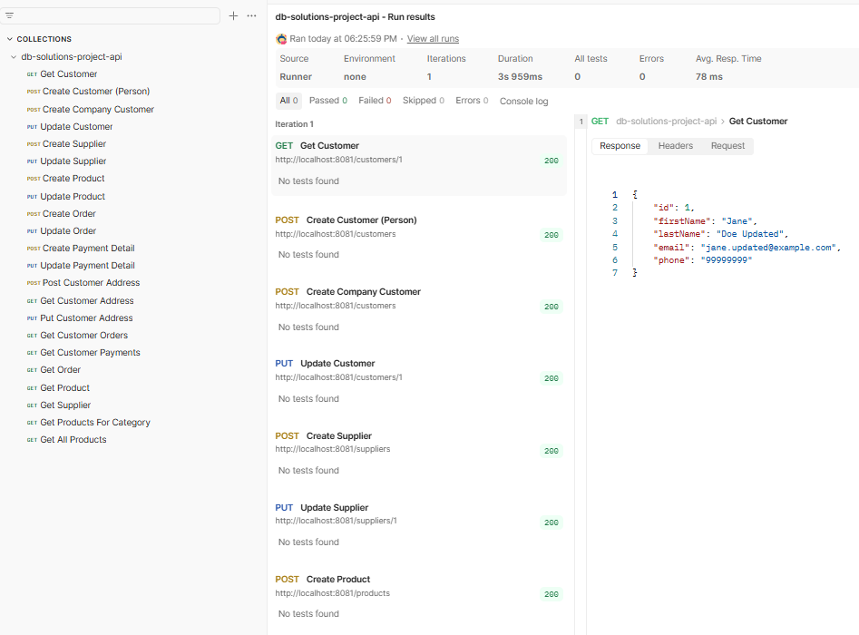

This README is also available in English: [README_en.md](README_en.md)

# API-projekti

Tämä projekti on API-järjestelmä, joka on rakennettu Spring Bootilla osana Metropolian kurssia Tietokantaratkaisut. API on valmis käytettäväksi verkkokauppasovelluksessa asiakkaiden näkökulmasta. API tukee perusoperaatioita asiakkaille, toimittajille, tuotteille, tilauksille ja maksuille. Lisäksi mukana on muutamia lisähakuja tuotteille ja asiakkaille. Muita ylläpitäjätason toiminnallisuuksia ei ole toteutettu, mutta ne voitaisiin lisätä myöhemmin. Tässä projektissa keskityttiin pääasiassa asiakasnäkymän API-päätepisteiden toteutukseen sekä siihen, että tietokantarakenne on verkkokauppa käyttöön sopiva.

## Ominaisuudet ja toteutus

Verkkokaupan API tarjoaa toiminnallisuuden asiakkaiden, tuotteiden, tilausten, maksujen ja toimittajien hallintaan. Asiakkaan näkökulmasta se tukee tuotteiden ja kategorioiden selaamista, tilausten luomista ja päivittämistä sekä osoitteidensa hallintaa ja maksujen tarkastelua.

## Tietokanta- ja taustajärjestelmäominaisuudet

Alla on lueteltu tietokannan ja taustajärjestelmän ominaisuuksia, jotka tekevät API:sta luotettavan ja tehokkaan. Osa näistä ominaisuuksista ei ole suoraan näkyvissä toteutetuissa API-päätepisteissä, mutta ne ovat tärkeitä kokonaisuuden kannalta ja lisäävät olennaisesti API:n toiminnallisuutta ja tehokkuutta.

- **Indeksit** 
  Luotu indeksi customers-tauluun sukunimille asiakashakujen nopeuttamiseksi. Admin-tason operaatioihin liittyen indeksejä on myös luotu orders-tauluun tilauksen statuksen perusteella ja suppliers-tauluun toimittajien nimien perusteella.

- **Näkymät** 
  Näkymä, joka näyttää kaikki uudet ja lähettämättömät tilaukset toimitustietoineen. Tämä tekee kyselyistä tehokkaampia ja helpottaa tilauksien hallintaa.

- **Liipaisimet ja tapahtumat** 
  Liipaisimia on toteutettu muutosten lokeja varten (yhteystietojen päivitykset-loki). Päivän päätteeksi tapahtuma tilausmäärille laskee päivän aikana tehdyt tilaukset ja tallentaa summan erilliseen tauluun, mikä helpottaa raportointia ja analytiikkaa.

- **Datan eheys ja transaktiot** 
  Rivikohtaiset lukot varmistavat tietojen eheyden, erityisesti varastosaldojen päivityksissä. Tämä estää keskeneräisten tietojen lukemisen samanaikaisissa transaktioissa.

- **Tietoturva** 
  Tietokannassa on kaksi käyttäjää: `webstoreadmin`, jolla on täydet oikeudet tauluihin (rajoitettu localhostiin) ja `webstoreuser`, jolla on rajattu pääsy tärkeimpiin tauluihin (`customers`, `customeraddresses`, `orders`, `orderitems`, `products`, `productcategories`). Tämä erottelu parantaa tietokannan tietoturvaa.

- **Temporaaliominaisuudet** 
  Tilauksilla ja tuotteiden hinnoilla on versiointi aikaleimojen ja voimassaoloaikojen avulla, jolloin historiallisten tietojen hakeminen on mahdollista.

- **Varmuuskopiot ja ylläpito** 
  Säännölliset varmuuskopiot ja ylläpitosuunnitelma on huomioitu kehitysvaiheessa, mutta varsinaisia varmuuskopiointi- tai ylläpitotehtäviä ei ole toteutettu tässä projektissa.

- **SwaggerUI** 
  Projekti sisältää SwaggerUI:n, joka tarjoaa interaktiivisen verkkokäyttöliittymän kaikkien API-päätepisteiden selaamiseen ja testaamiseen. Sovelluksen ollessa käynnissä, SwaggerUI on saatavilla osoitteessa `http://localhost:8081/swagger-ui/index.html`, josta näet kaikki käytettävissä olevat päätepisteet, niiden pyyntö- ja vastausformaatit sekä voit testata niitä suoraan selaimesta.
  - **Postman Collection**  
    Päätepisteet on testattu myös Postmanilla. Kokoelma ei sisällä testejä, mutta se sisältää esimerkkipyyntöjä ja -vastauksia kaikille päätepisteille, mikä tekee päätepisteiden samanaikaisesta testaamisesta helppoa. Tämän projektin [Postman collection](https://rest55-1951.postman.co/workspace/apitest~c810551e-bda4-45fe-ac5d-7ae92afb4cf8/collection/43611499-d300b680-1c58-42c8-be26-b5d91afe9ccf?action=share&source=copy-link&creator=43611499) on julkinen, mutta Postman saattaa silti vaatia käyttöoikeuksia sen avaamiseen. Tässä on kuvakaappaus viimeisimmästä ajosta:

  

## Verkkokaupan API-dokumentaatio

Seuraavissa taulukoissa ovat kaikki verkkokaupan API-päätepisteet. Jokaisesta päätepisteestä on listattu HTTP-metodi ja polku sekä lyhyt kuvaus päätepisteestä. Esimerkki request boydy on annettu JSON-muodossa niille päätepisteille, jotka sitä vaativat.
Kaikille päätepisteille on myös esimerkki odotetusta vastauksesta JSON-muodossa sekä HTTP-statuskoodit.

---

### Asiakkaat

| Metodi & Polku               | Kuvaus                         | Esimerkki pyynnöstä                                                                                             | Esimerkki vastauksesta                                                                                                              | Huomautukset           |
| ---------------------------- | ------------------------------ | --------------------------------------------------------------------------------------------------------------- | ----------------------------------------------------------------------------------------------------------------------------------- | ---------------------- |
| GET /customers/{id}          | Hae asiakas ID:n perusteella   | —                                                                                                               | `{ "id": 1, "firstName": "Jane", "lastName": "Doe", "email": "jane@example.com", "phone": "12345678" }`                             | 200 OK / 404 Not Found |
| POST /customers              | Luo henkilöasiakas             | `{ "firstName": "Jane", "lastName": "Doe", "email": "jane@example.com", "phone": "12345678" }`                  | Luotu asiakas JSON                                                                                                                  | 201 Created            |
| POST /customers              | Luo yritysasiakas              | `{ "companyName": "Tech Corp", "vatNumber": "FI1234567", "email": "contact@techcorp.com", "phone": "5551234" }` | Luotu asiakas JSON                                                                                                                  | 201 Created            |
| PUT /customers/{id}          | Päivitä asiakas                | `{ "firstName": "Jane", "lastName": "Doe Updated", "email": "jane.updated@example.com", "phone": "99999999" }`  | Päivitetty asiakas JSON                                                                                                             | 200 OK / 404 Not Found |
| POST /customers/{id}/address | Lisää asiakkaalle osoite       | `{ "streetAddress": "Mannerheimintie 10", "postalCode": "00100", "city": "Helsinki", "country": "Finland" }`    | Luotu osoite JSON                                                                                                                   | 201 Created            |
| GET /customers/{id}/address  | Hae asiakkaan osoite           | —                                                                                                               | `{ "streetAddress": "Mannerheimintie 10", "postalCode": "00100", "city": "Helsinki", "country": "Finland" }`                        | 200 OK                 |
| PUT /customers/{id}/address  | Päivitä asiakkaan osoite       | `{ "streetAddress": "Mannerheimintie 100", "postalCode": "00100", "city": "Helsinki", "country": "Finland" }`   | Päivitetty osoite JSON                                                                                                              | 200 OK                 |
| GET /customers/{id}/orders   | Hae kaikki asiakkaan tilaukset | —                                                                                                               | `[ { "id": 1, "orderDate": "2026-03-05T10:00:00", "deliveryDate": "2026-03-10T10:00:00", "status": "NEW" } ]`                       | 200 OK                 |
| GET /customers/{id}/payments | Hae kaikki asiakkaan maksut    | —                                                                                                               | `[ { "id": 1, "orderId": 1, "cardNumber": "1234-5678-9012-3456", "paymentStatus": "PAID", "paymentDate": "2026-03-05T11:00:00" } ]` | 200 OK                 |

---

### Toimittajat

| Metodi & Polku      | Kuvaus                          | Esimerkki pyynnöstä                                                                                                     | Esimerkki vastauksesta                                                                                                           | Huomautukset           |
| ------------------- | ------------------------------- | ----------------------------------------------------------------------------------------------------------------------- | -------------------------------------------------------------------------------------------------------------------------------- | ---------------------- |
| POST /suppliers     | Luo toimittaja                  | `{ "name": "Book Suppliers Ltd", "contactName": "John Supplier", "phone": "5555678", "email": "supplier@example.com" }` | Luotu toimittaja JSON                                                                                                            | 201 Created            |
| PUT /suppliers/{id} | Päivitä toimittaja              | `{ "name": "Updated Supplier", "contactName": "Alice", "phone": "5550000", "email": "updated@supplier.com" }`           | Päivitetty toimittaja JSON                                                                                                       | 200 OK                 |
| GET /suppliers/{id} | Hae toimittaja ID:n perusteella | —                                                                                                                       | `{ "id": 1, "name": "Book Suppliers Ltd", "contactName": "John Supplier", "phone": "5555678", "email": "supplier@example.com" }` | 200 OK / 404 Not Found |

---

### Tuotteet

| Metodi & Polku                      | Kuvaus                                         | Esimerkki pyynnöstä                                                                                                                                                                                     | Esimerkki vastauksesta                                                                                           | Huomautukset           |
| ----------------------------------- | ---------------------------------------------- | ------------------------------------------------------------------------------------------------------------------------------------------------------------------------------------------------------- | ---------------------------------------------------------------------------------------------------------------- | ---------------------- |
| POST /products                      | Luo tuote                                      | `{ "name": "Bookfind", "description": "Keep finding books", "price": 123.00, "stockQuantity": 10, "categoryId": 2, "startDate": "2026-03-01", "endDate": "2026-12-31", "supplierIds": [1] }`            | Luotu tuote JSON                                                                                                 | 201 Created            |
| PUT /products/{id}                  | Päivitä tuote                                  | `{ "name": "Bookfind Updated", "description": "Updated description", "price": 150.00, "stockQuantity": 20, "categoryId": 2, "startDate": "2026-03-01", "endDate": "2026-12-31", "supplierIds": [1,2] }` | Päivitetty tuote JSON                                                                                            | 200 OK                 |
| GET /products                       | Hae kaikki tuotteet                            | —                                                                                                                                                                                                       | `[ { "id": 1, "name": "Bookfind", "price": 123.00, "stockQuantity": 10, "categoryId": 2, "supplierIds": [1] } ]` | 200 OK                 |
| GET /products/{id}                  | Hae tuote ID:n perusteella                     | —                                                                                                                                                                                                       | `{ "id": 1, "name": "Bookfind", "price": 123.00, "stockQuantity": 10, "categoryId": 2, "supplierIds": [1] }`     | 200 OK / 404 Not Found |
| GET /products/category/{categoryId} | Hae tuotteet kategorian perusteella            | —                                                                                                                                                                                                       | `[ { "id": 1, "name": "Bookfind", "price": 123.00, "stockQuantity": 10, "categoryId": 2, "supplierIds": [1] } ]` | 200 OK                 |
| PATCH /products/update-price        | Päivitä kaikkien tuotteiden hinnat prosentilla | `{ "percentage": 10.0 }`                                                                                                                                                                                | —                                                                                                                | 200 OK                 |
| POST /products/search               | Hae tuotteet hintahaarukalla                   | `{ "minPrice": 100.0, "maxPrice": 200.0 }`                                                                                                                                                              | `[ { "id": 1, "name": "Bookfind", "price": 123.00, "stockQuantity": 10, "categoryId": 2, "supplierIds": [1] } ]` | 200 OK                 |

---

### Tilaukset

| Metodi & Polku   | Kuvaus                      | Esimerkki pyynnöstä                                                                                                                           | Esimerkki vastauksesta                              | Huomautukset           |
| ---------------- | --------------------------- | --------------------------------------------------------------------------------------------------------------------------------------------- | --------------------------------------------------- | ---------------------- |
| POST /orders     | Luo tilaus                  | `{ "customerId": 1, "orderDate": "2026-03-05T10:00:00", "deliveryDate": "2026-03-10T10:00:00", "shippingAddressId": 5, "status": "NEW" }`     | Luotu tilaus JSON                                   | 201 Created            |
| PUT /orders/{id} | Päivitä tilaus              | `{ "customerId": 1, "orderDate": "2026-03-05T10:00:00", "deliveryDate": "2026-03-12T10:00:00", "shippingAddressId": 5, "status": "SHIPPED" }` | Päivitetty tilaus JSON                              | 200 OK                 |
| GET /orders/{id} | Hae tilaus ID:n perusteella | —                                                                                                                                             | `{ "id": 1, "customerId": 1, "status": "SHIPPED" }` | 200 OK / 404 Not Found |

---

### Maksut

| Metodi & Polku     | Kuvaus        | Esimerkki pyynnöstä                                                                                                        | Esimerkki vastauksesta | Huomautukset |
| ------------------ | ------------- | -------------------------------------------------------------------------------------------------------------------------- | ---------------------- | ------------ |
| POST /payments     | Luo maksu     | `{ "orderId": 1, "cardNumber": "1234-5678-9012-3456", "paymentStatus": "PAID", "paymentDate": "2026-03-05T11:00:00" }`     | Luotu maksu JSON       | 201 Created  |
| PUT /payments/{id} | Päivitä maksu | `{ "orderId": 1, "cardNumber": "1234-5678-9012-3456", "paymentStatus": "REFUNDED", "paymentDate": "2026-03-05T12:00:00" }` | Päivitetty maksu JSON  | 200 OK       |
